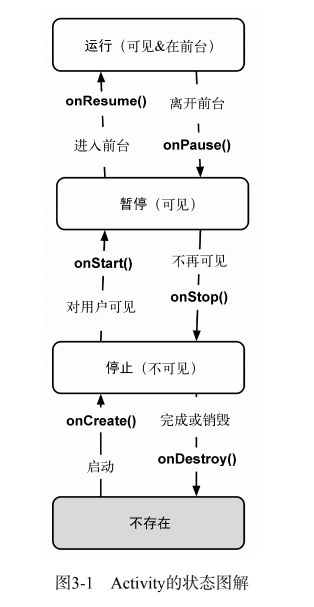
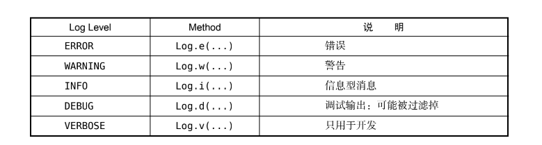

# android编程指南入门学习：

## 第一章：

- 新建android项目，修改xml文件-修改项目的控件
- layout中的xml引用values文件夹中的strings.xml，通过"@string/false_button"
- android studio Session 'app': Error Installing APK解决方法
  - 尝试Build -> Clean Project再编译。
- 在activity中引用已经xml生成的组件：public View findViewById(int id)
- android 应用属于典型的事件驱动类型：
  - 使用匿名内部类来实例化监听器，监听器是首先特定监听器接口的对象
- Android的toast
是用来通知用户的简短弹出消息，用户无需输入或进行任何操作。

Gradle编译android项目：

1. 进入项目目录
2. ./gradlew tasks //编译项目
3. ./gradlew installDebug // 安装项目到当前连接的设备上

## 第二章 andoriod 与MVC设计模式：

- 配置android项目，修改变量前缀识别，在codeStyle CodeGeneration中
- 资源，通过java R类去找到，返回的id 是一个int类型的数据
- 在控制器中，找String资源，使用R.string.xx 找视图的话， 使用findViewById（R.id.视图id）（记得cast to 视图的类型）


- 为控制应用包的大小，我们可以只为主流设备准备分辨率较高的定制图片资源。至于那些不常见的低分辨率设备，让Android系统自动适配就好。

- 向应用中添加图片：
  - 建立不同像素率的文件夹，将不同像素的图片，放到不同的文件夹中去。图省事，可以只放高像素的图片。
  - 注意点：图片后缀为：.jpg .png .gif 能够自动获得资源id，（注意，文件名必须是小写字母且不能有任何空格符号。）
- 挑战练习：为 TextView 添加监听器

## 第三章 项目的生命周期以及设备旋转

- andoriod 应用的生命周期：




- Log.d()// debug 日志输入，前面是


```java
// 周期函数：
    @Override
    public void onStart() {
        super.onStart();
        Log.d(TAG, "onStart() called");
    }
    @Override
    public void onPause() {
        super.onPause();
        Log.d(TAG, "onPause() called");
    }
    @Override
    public void onResume() {
        super.onResume();
        Log.d(TAG, "onResume() called");
    }
    @Override
    public void onStop() {
        super.onStop();
        Log.d(TAG, "onStop() called");
    }
    @Override
    public void onDestroy() {
        super.onDestroy();
        Log.d(TAG, "onDestroy() called");
    }
```

- LogCat右上角添加过滤器，来查看tag的打印消息

- 在应用程序的设备配置发生改变，andorid就会销毁掉当前的activity，然后创建新的activity，比如：键盘，语言的改变，旋转屏幕。
- 在旋转之后，或者是暂时退出应用，使用protected void onSaveInstanceState(Bundle outState)保存当前的数据，或者进入暂存状态，（在后台，但是没有被销毁）会自动执行上面的函数。所以覆盖实现，在这个函数中存储数据到Boundle中去。

- 各种日志记录级别：



## 第四章 android应用的调试：

- LogCat查看日志：
- 记录栈跟踪的诊断性日志：在日志输出函数的函数，第三个参数新建一个 EXception（）
- 利用调试器设置断点调试
- 异常断点：就是使用断点来捕获异常，需要在View BreaKpoints 设置异常断点。当有某一个异常发生的时候，就当作断点处理。
- Android Lint：是Android应用代码的静态分析器。 Analyze Inspect Code运行 Lint
- 清理项目：Build Clean Project菜单项。

## 第五章：第二个activity

