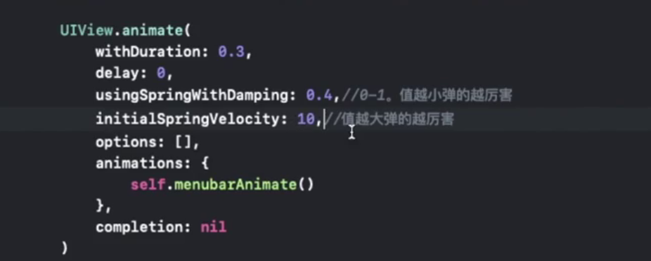
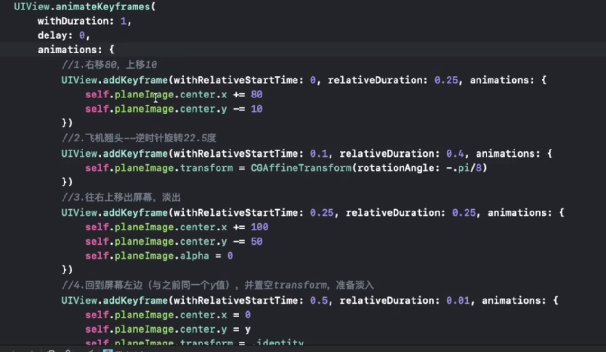

# lebus教程05

## 旅行打包清单app-ios动画

- p76 了解开发app的需求：
- 了解到做简单的动画的三步骤：
  - 起始状态
  - 结束状态
  - 转换时间
- 了接到项目需要在view Controller中使用tableview
- 需要增加协议绑定，并且如何在代码中新建一个uiimageview

- 约束动画和属性动画：
- 可以像拉控件一样，将约束拉到代码段中，进行属性的修改


``` swift
// 通过bool修改 改变约束的属性来实现动画
UIView.animate(withDuration:0.3){
    self.menuHeight.constant = self.menuIsOpen ? 200 : 80
   
    // 旋转
    let angle = self.menuIsOpen ? CGFloat.pi/4 : 0// caculate angle
    self.bttonMenu.transform = CGAffineTransform(rotationAngle:angle)// transform属性：旋转，缩放，过渡
    self.view.layoutIfNeeded()//让约束 变化一帧帧体现出来
}
```

- 改变约束的乘数（multiplier)来做动画：
  - 拉约束，直接访问multiplier属性，是不能进行修改的
  - 方法：在一个控件上，定义两个意思不一样的约束，给其中一个约束取消install，并且降低优先级
  - 拉到代码中，  通过code动态改变控件的isactive 属性；

  - 动态的生成imageView：
  - 使用类的构造方法即可
  - 设置背景颜色，圆角：backgroundColor,laryer.cornerRadius属性
  - 取消自动推断约束  ` translatesAutoresizingMaskIntoConstraints = false`
  - 通过规定开始和结束的约束值来实现动画：


``` swift
// begin constraint
let conWidth = imageView.widthAnchor.constraint(equalTpConstrant:100)
let conHeigth =     // 等于高的 imageView.widthAnchor
let conX = imageView.centerXAnchor.constraint(equalTo:view.centerXAnchor)
let conY = imageView.bottomAnchor.constraint(equalTo:view.bottomAnchor,constant:100)
// active constraints
NSLayoutConstraint.active([conWidth, , ,conY])
// 立即生效
view.layoutIfNeeded()

// setting end statud and during time
UIView.animate(
    withDuration:0.5,
    delay:0,
    options: .curveEaseOut,//慢出
    animations:{
        conWidth.constant = 150
        conY.constant = -150
        self.view.layoutIfNeeded()
    },
    completion:nil
    
)

// delay and display 显示一会之后消失
UIView.animate(
    withDuration:0.5,
    delay:2,
    animations:{
        conWidth.constant = 100
        conY.constant = 100
        self.view.layoutIfNeeded()
    }
) {_ in 
        // 结束之后的回调函数：销毁imageView
        imageView.removeFromSuperview()
}
``` 

- 弹簧动画：使用弹簧动画，动画的时间稍微设置长一点
  - 使用uiview.animate()//带有spring参数的函数
  - 弹性阻力：SpringWithDamping 0-1之间
  - 初始速度：SpringVelocity:
  - 格式化方法 option+⬅️到最前面的一个单词，然后回车
  - options ： []


  

- 修改属性：center，frame的值来实现动画
  - 通过修改frame里面的wid，height等属性，放到动画函数中，进行动画
  - view.center.x,.y的修改

- 修改属性来做动画

```swift
// delay
func delay(seconds:Double,completions:@escapting()->Void){
    DispatchQueue.main.asyncAfter(deadline:.new() + seconds,execute:completion)
}
```

- 淡入淡出动画：
  - MARK：- //分段
  - 新造一个临时的imageview，透明度为0，图像设置为新要出现的图片，
  - 覆盖在原来的背景图片上面：结束的时候把透明度改成1
  - 将原来的imageView中背景图片该改成现在的，然后移除temp imageView
  - 

```swift
// fade in-out
func fade(toImage:UIImage,showEffdects:Bool){
    let temp = UIImageView 
    temp.image = toImage
    temp.alpha = 0
    view.insertSubview(temp,aboveSubview:bgImageView)//指定在哪个图层上面

    UIView.animate(
        withDuration:0.5,
        animations:{
            temp.alpha = 1
        }
    ){ _ in
    // compesion: 销毁temp
        bgImageView.image = toimage
        temp.removeFromSuperView()
    } // change alpha 0就是不显示，1就是显示
}
```

- p84 translation和alpha值来做移出移入动画
- 临时label 带着后来的text，从右边偏移80的位置，0透明度，结束：往左移回来，并且透明度1
- 真实的label 结束：从左往右，从1变到0
- 完成之后，将真实label，改回原处，text值改成目标值，去掉 temp labl。

```swift

func moveLabel(currentLabel:UILabel,toText:String){
    let temp = duiplicateLabel(label:currentLabel)
    temp.text = toText
    temp.transform = CGAddineTransforn(franslationX:80,y:0)
    temp.alpha = 0
    view.addSubview(temp)
    // 动画设置函数，移处当前label，移去temp label
    UIView.animate(
        withDuration:0.5,
        animations:{
            currentLabel.transform = CGAffineTransform(translationX:80,y:0)

            temp.transform = .identity //回到初始值
            temp.alpha = 1
        }
    ){ _ in //结束动画之后的（回调函数）代码
        currentLabel.text = toText

        cuttentLabel.transform = .dentity
        currentLabel.alpha = 1
        temp.removeFromSuperview()
    }
}

```

- 关键帧动画：
  - 使用函数：UIView.animateKeyframes() 
  - 里面可以调用多个动画，使他们衔接起来：UIView.addKeyframe(xxx)
  


