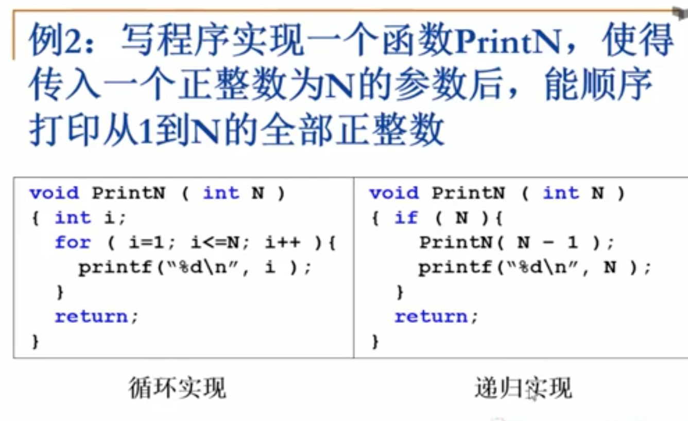
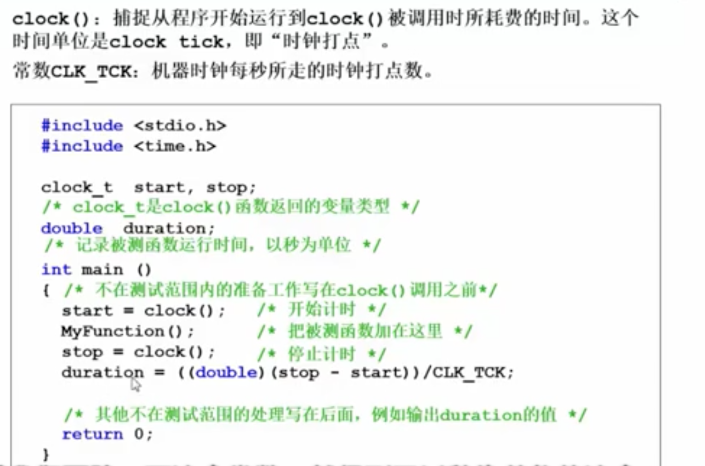
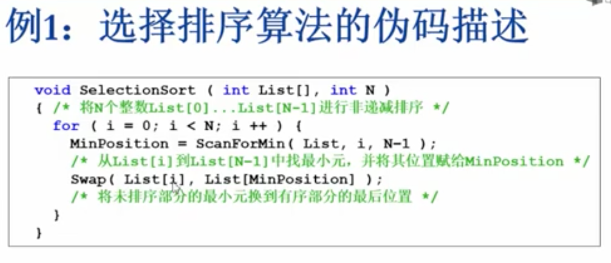
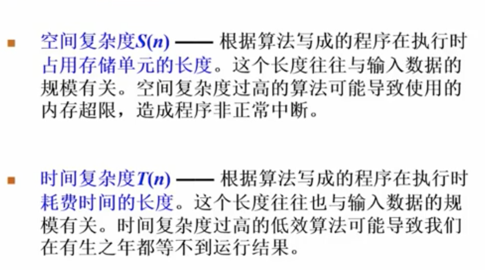
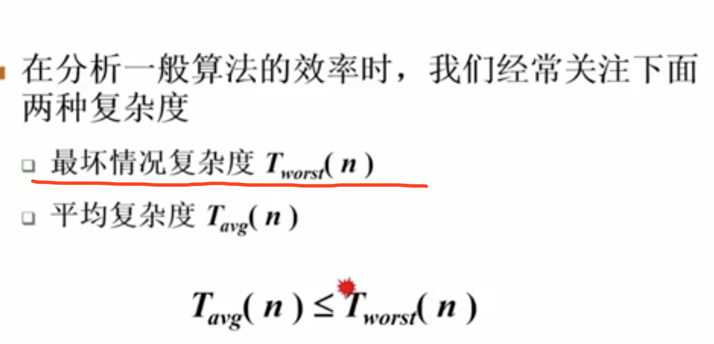
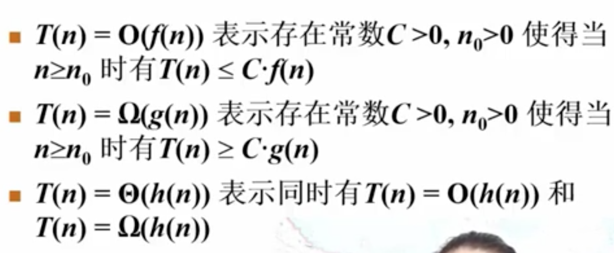
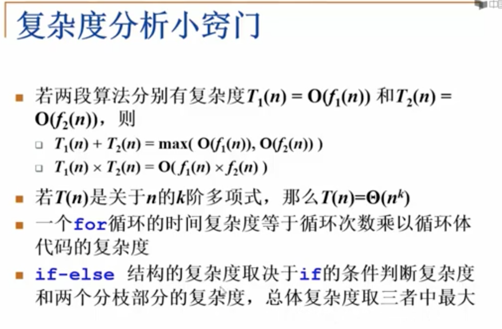
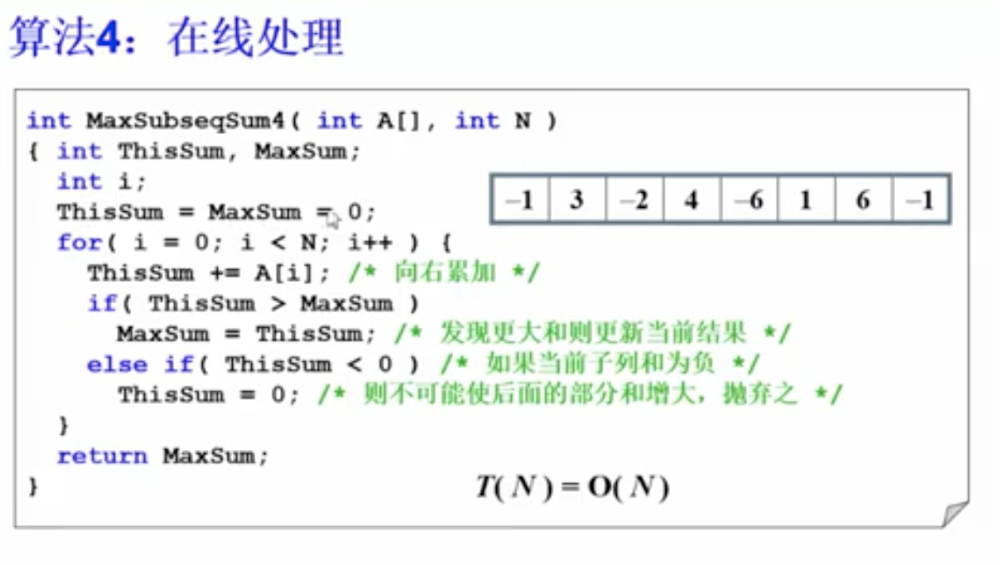

# 第一讲：基本概念

基本介绍：

1. 解决问题方法的效率，跟数据的组织方式有关；
2. 解决问题方法的效率，跟空间的利用效率有关
3. 解决问题方法的效率，跟算法的巧妙程度有关；



后一个，容易内存爆炸：


计算程序时间：


什么是数据结构？
数据对象在计算机中的组织方式

数据对象必定与一系列加在其上的操作相关联
完成这些操作所用的方法就是算法：


### 抽象数据类型：

- 数据类型：
  - 数据对象集
  - 数据集合相关联的操作集

- 抽象：描述数据类型的方法不依赖于具体实现
  - 与存放数据的机器无关
  - 与数据存储的物理结构无关
  - 与实现操作的算法和编程语言无关


### 算法： 
什么是算法？

- 一个有限指令集
- 接受一些输入（有些情况不需要）
- 产生输出
- 一定在有限步骤之后终止
- 每一条指令必须
  - 有充分明确的目标，不可以有歧义
  - 计算机能够处理的范围之内
  - 描述应不依赖于任何一种计算机语言以及具体的实现手段

### 选择排序：


什么是好算法：


S（N） = C * N  // 对于递归打印；

机器做 加减法比乘除法快很多。影响快慢在于乘除法的数目



复杂度的渐近表示法：

- 最小上界
- 最大下界

$$ 1<logN<n<nlogn<n^2<n^3<2^n<n!$$



算法：**最大子序列问题**

分而治之的思想： NlogN

在线处理： N



```c++

int Max3( int A, int B, int C )
{ /* 返回3个整数中的最大值 */
    return A > B ? A > C ? A : C : B > C ? B : C;
}
 
int DivideAndConquer( int List[], int left, int right )
{ /* 分治法求List[left]到List[right]的最大子列和 */
    int MaxLeftSum, MaxRightSum; /* 存放左右子问题的解 */
    int MaxLeftBorderSum, MaxRightBorderSum; /*存放跨分界线的结果*/
 
    int LeftBorderSum, RightBorderSum;
    int center, i;
 
    if( left == right )  { /* 递归的终止条件，子列只有1个数字 */
        if( List[left] > 0 )  return List[left];
        else return 0;
    }
 
    /* 下面是"分"的过程 */
    center = ( left + right ) / 2; /* 找到中分点 */
    /* 递归求得两边子列的最大和 */
    MaxLeftSum = DivideAndConquer( List, left, center );
    MaxRightSum = DivideAndConquer( List, center+1, right );
 
    /* 下面求跨分界线的最大子列和 */
    MaxLeftBorderSum = 0; LeftBorderSum = 0;
    for( i=center; i>=left; i-- ) { /* 从中线向左扫描 */
        LeftBorderSum += List[i];
        if( LeftBorderSum > MaxLeftBorderSum )
            MaxLeftBorderSum = LeftBorderSum;
    } /* 左边扫描结束 */
 
    MaxRightBorderSum = 0; RightBorderSum = 0;
    for( i=center+1; i<=right; i++ ) { /* 从中线向右扫描 */
        RightBorderSum += List[i];
        if( RightBorderSum > MaxRightBorderSum )
            MaxRightBorderSum = RightBorderSum;
    } /* 右边扫描结束 */
 
    /* 下面返回"治"的结果 */
    return Max3( MaxLeftSum, MaxRightSum, MaxLeftBorderSum + MaxRightBorderSum );
}
 
int MaxSubseqSum3( int List[], int N )
{ /* 保持与前2种算法相同的函数接口 */
    return DivideAndConquer( List, 0, N-1 );
}
```