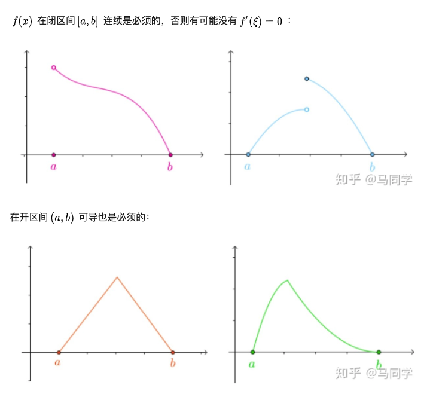

## [三个中值定理](https://zhuanlan.zhihu.com/p/47436090)

- 罗尔中值定理：

设函数满足以下三个条件：
1. $f(x)$ 在闭区间[a,b] 上连续
2. $f(x)$ 在开区间(a,b) 上可导
3. $f(a)=f(b)$
则存在$\epsilon \in$(a,b)，使得$f(\epsilon)'=0$

- 拉格朗日中值定理:

设函数满足以下三个条件：
1. $f(x)$ 在闭区间$[a,b]$ 上连续
2. $f(x)$ 在开区间$(a,b)$ 上可导
<!-- 3. $f(a)=f(b)$ -->
则存在$\epsilon \in$(a,b)，使得$f(\epsilon)'= \frac{f(b)-f(a)}{b-a}$

- 柯西中值定理:

设函数$f(x),g(x)$满足以下条件：
1. $f(x),g(x)$ 在闭区间$[a,b]$ 上连续
2. $f(x),g(x)$ 在开区间$(a,b)$ 上可导
3. $\forall x \in (a,b)$ 有：$g(x)'\not ={0}$

则存在$\epsilon \in(a,b)$ ，使等式$\frac{f(b)-f(a)}{g(b)-g(a)}=\frac{f(\epsilon)'}{g(\epsilon)'}$
成立。