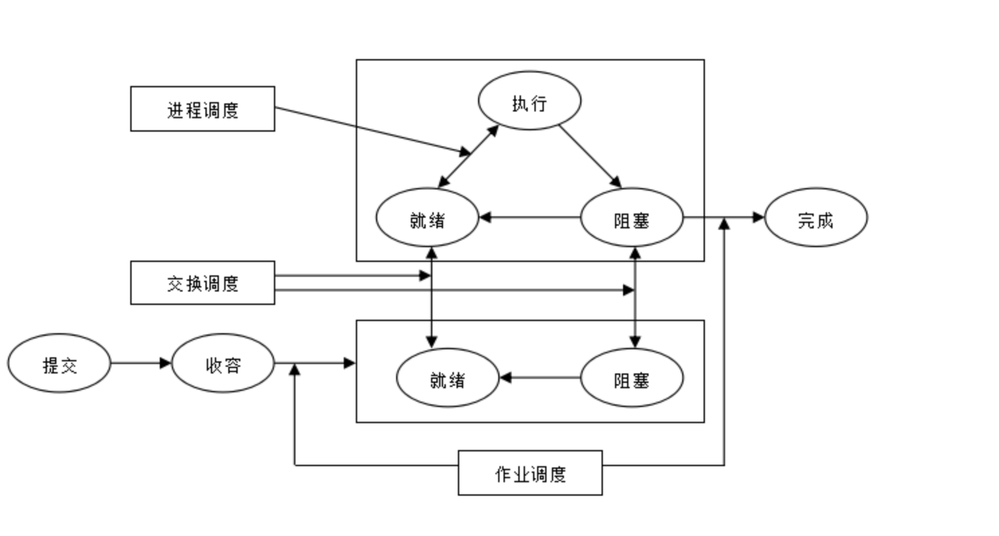
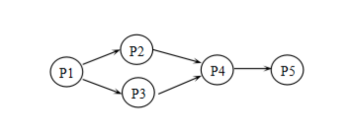
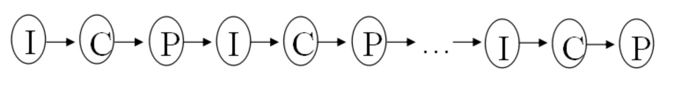
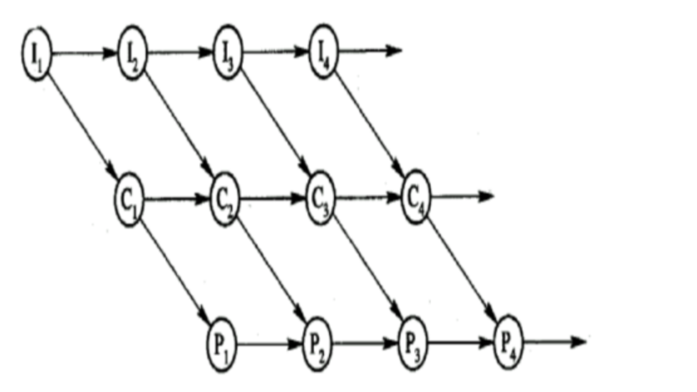
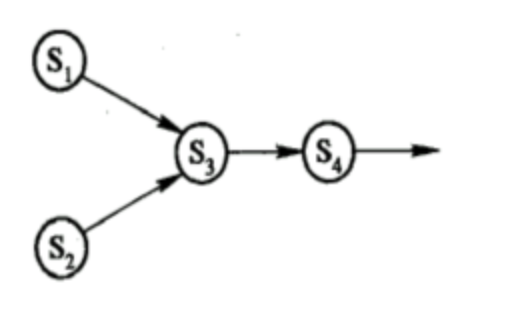
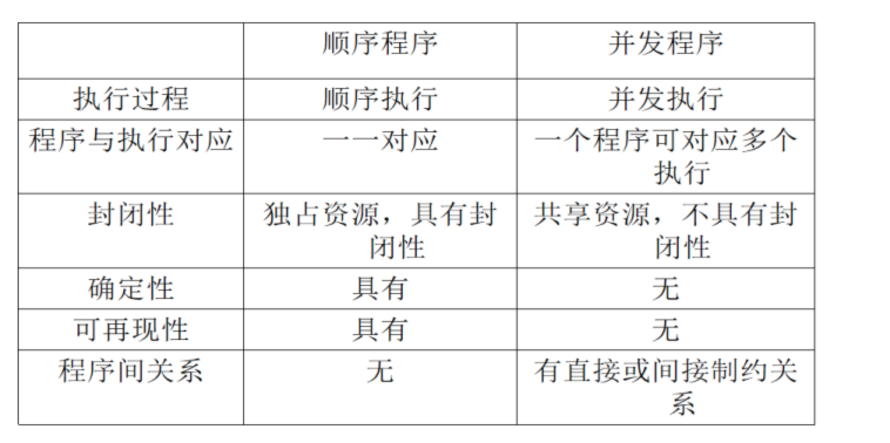

### 处理器管理。包括进程控制、进程互斥等[参考资料](https://blog.csdn.net/qq_29053423/article/details/105138685)

**1. 进程控制**

进程控制的主要任务就是为程序创建进程，撤销已结束的进程，以及控制进程在运行过程中的状态转换。在操作系统中，通常是利用若干条进程控制原语或系统调用，来实现进程的控制。所谓“原语”是指用以完成特定功能的、具有“原子性”的一个过程。

**1.2. 进程同步**
进程同步的主要任务是对众多的进程运行进行协调。

协调方式有两种：

（1）进程互斥方式
进程在对临界资源访问时，应采用互斥方式，也就是当一个进程访问临界资源时，另一个要访问该临界资源的进程必须等待；当获取临界资源的进程释放临界资源后，其他进程才能获取临界资源。这种进程之间的相互制约关系称为互斥。

对于进程互斥，最简单的实现方式就是设置锁，通过加锁、解锁实现互斥。

（2）进程同步方式
 相互合作的进程，由同步机构对它们的执行次序加以协调。也就是前一个进程结束，后一个进程才能开始；前一个进程没有结束，后一个进程就不能开始。**这种进程之间的相互合作关系称为同步。**

在系统中，进程的同步可以有多种实现方法，其中，最常用的方法是信号量机制。

**1.3. 进程通信**

进程通信的任务就是用来实现相互合作进程之间的信息交换。

（1）直接通信方式
当相互合作的进程处于同一台计算机系统时，通常采用直接通信方式。由源进程利用发送命令直接将消息发送到目标进程的消息队列上，然后由目标进程利用接收命令从其消息队列中取出消息。

（2）间接通信方式
当相互合作的进程处于不同计算机系统时，通常采用间接通信方式。由源进程利用发送命令将信息发送到一个专门存放消息的中间实体中，然后由目标进程利用接收命令从中间实体中取出消息。这个中间实体通常称为“邮箱”，相应的通信系统称为电子邮件系统。

**1.4. 处理器调度**

一个批处理作业从进入系统并驻留在外存的后备队列上开始，直至作业运行完毕，可能要经历下述三级调度。

（1）高级调度

它又称为作业调度、长程调度或宏观调度，它的功能是按照某种原则把外存上处于后备队列中的那些作业调入内存，并为它们创建进程、分配必要的资源，然后再将新创建的进程排在就绪队列上，准备执行。

在批处理系统中有高级调度，而在分时系统中一般无高级调度。

（2）低级调度

它通常又称进程调度、短程调度或微观调度，它的功能是按照某种原则决定就绪队列中的哪个进程应获得处理机，再由分配程序执行处理机分配给该进程的具体动作。

进程调度是操作系统中最基本的调度，在批处理系统和分时系统中都必须配置它。

（3）中级调度

中级调度又称中程调度或交换调度。它负责内外存之间的进程对换，以解决内存紧张的问题，提高内存利用率和系统吞吐量。

二、程序执行
程序执行是指程序在计算机中的运行过程。程序的执行可以用前趋图表示，程序的执行方式有顺序执行和并发执行两种。

1. 前趋图
前趋图是一个有向无循环图。图中的每个节点可用于表示一条语句、一个程序段等；节点间的有向边表示在两个节点之间存在的前趋关系。如Pi→Pj，称Pi是Pj的前趋，而Pj是Pi的后继。在前趋图中，没有前趋的节点称为初始节点，没有后继的节点称为终止节点。应当注意的是，前趋图中不能存在循环。

 

在上图所示的前趋图中存在下述前趋关系：

    P1→P2，P1→P3，P2→P4，P3→P4，P4→P5。

2. 程序的顺序执行
（1）程序顺序执行的概念
一个程序通常可分为多个程序段，它们必须按照某种先后次序执行，仅当前一操作执行完后，才能执行后继操作。这里，我们用结点（Node）代表各程序段的操作，用I代表输入操作，C为计算操作，P为打印操作，用箭头表示其操作顺序 

（2）程序顺序执行的特征

①顺序性。严格按照程序所规定的顺序执行。

②封闭性。程序在封闭的环境下执行，其执行结果不受外界因素的影响。

③确定性。程序执行的结果与它的执行速度无关，不会影响到最终结果。

④可再现性。只要程序执行的环境和初始条件相同，都将获得相同的结果。

3. 程序的并发执行
（1）程序并发执行的概念
在处理一批程序时，它们之间有时并不存在严格的执行次序，可以并发执行。

程序并发执行时的前趋图，如下图所示。

Ｉ２、Ｃ１可以并发执行

Ｉ３、Ｃ２、Ｐ１可以并发执行。

对于具有下述四条语句的程序段：

         S1： a ：＝x十2

          S2：b：=y十4

          S3：c：=a十b

          S4：d：＝c＋b

四条语句的前趋图：

（2）程序并发执行的特征
①间断性。在程序并发执行时，它们之间共享资源或相互合作，形成了相互制约的关系，表现为“执行—暂停执行—执行”的间断性活动规律。

②失去封闭性。程序并发执行时，多个程序共享系统中的各种资源，致使程序的运行失去了封闭性。这样，一个程序在执行时，必然会受到其他程序的影响。

③不可再现性。即使并发程序执行的环境和初始条件相同，程序多次执行或以不同的方式执行都可能获得不相同的结果。

④资源共享性。系统中的硬件资源（CPU、内存和I/O设备等）和软件资源（系统程序和数据集等）为多个用户或作业共同使用。

⑤程序和计算不再一一对应。

**4.并发与顺序的比较**

