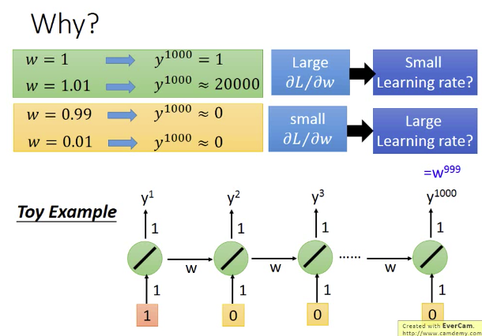

## 大数据：

大数据定义：
1. 量大 （Volume
2. 多样 （Variety
3. 高速 （Velocity
4. 低价值 （Value

## LSTM的结构：
- 我们先说RNN：
RNN是说，第一个时刻，例如t1时刻的输出，会被存起来，然后在第二个时刻，加入到输入里面去。也就是此时的网络，会加入上一个时刻输出的信息。（训练的时候，规定loss不能太大）
RNN奇特的特性：同样的东西，反复被使用。w

计算方法：BPTT：

- LSTM是基于RNN的改进版：
lstm能够解决，梯度消失的问题：
它使用三个门 input gate(记忆一部分) forget gate（以往的记忆清空多少） output gate（输出到下一阶段的值）
记忆和input是相加的，input乘一个系数，加入的forget gate

遗忘门确定前一个步长中哪些相关的信息需要被保留；输入门确定当前输入中哪些信息是重要的，需要被添加的；输出门确定下一个隐藏状态应该是什么。

- GRU：联动input gate 和 forget gate，必须把 记忆单元的值清除，才能加入新的值。