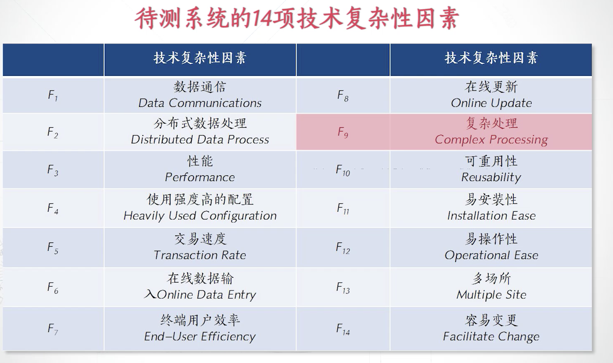
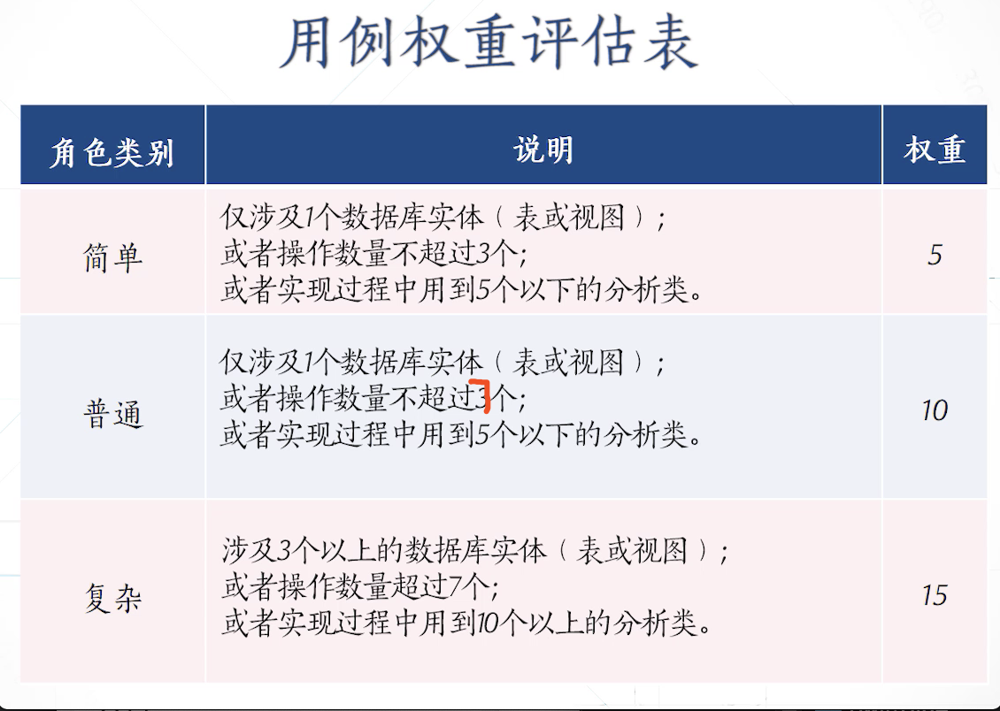
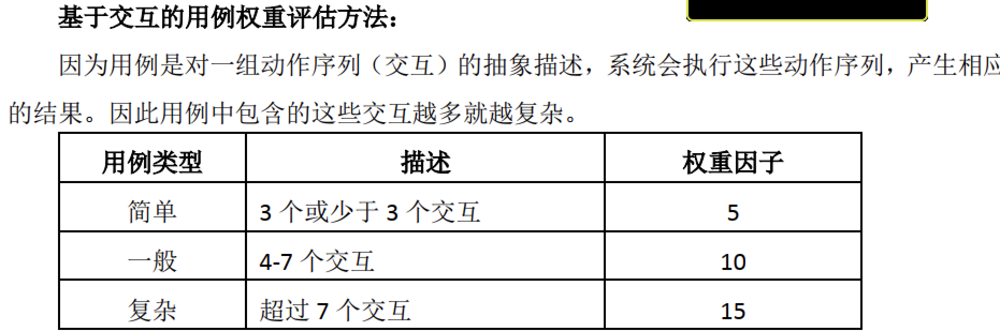
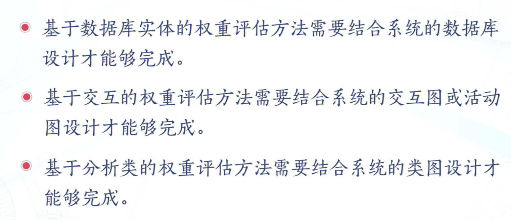
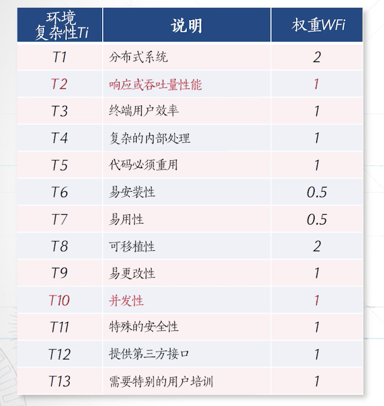
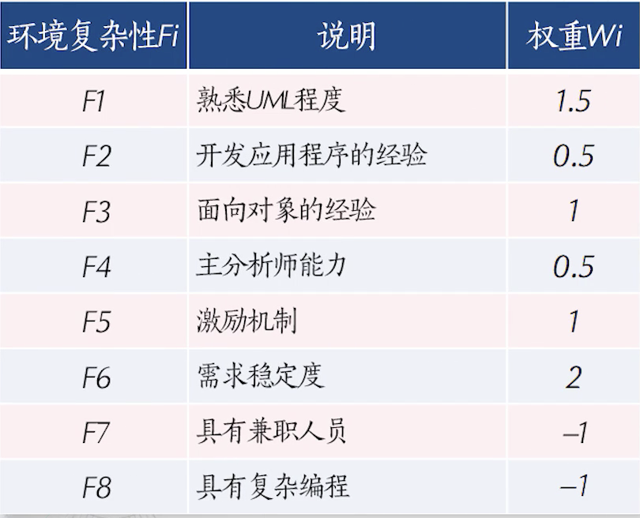

# 需求分析阶段的度量

### 功能点度量方法：

功能点度量方法是利用软件需求分析度量软件规模

功能需求

- 数据流图

数据功能

交易功能

第一步：分析系统中**内部逻辑文件、外部接口文件、外部输入、外部输出以及外部查询**这五个项目的数量

第二步、计算未调整前的功能点数

第三步：判断以上五个项目的复杂性等级，每个项目都有三种等级

第四步、计算复杂度调整系数：VAF

第五部、FP=UFCxVAF （功能点数）

- 性能需求：

功能点度量方法的应用：

- 预测软件规模
- 计算缺陷密度
- 估算软件工作量
- 估算软件成本
- 计划开发时间
- 计划人员安排

功能点度量的优点：

- 在软件需求分析阶段就可以对软件规模进行预测，不需要等到软件设计与实现阶段

功能点度量的缺点：

- 计算过程带有主观性；
- 功能点计算结果不直观
- 应用领域具有局限性
- 

**适合于度量数据处理较多的系统**

### 用例点度量方法：

- 用例图

分析用例图中对角色与用例来对软件的规模进行度量

六个步骤：

1. 计算未调整前的角色权重（UAW）
2. 计算未调整前的用例权重（UUC）
3. 计算未调整前的用例点（UUCP）UUCP = UAW +UUC
4. 计算技术复杂因子（TCF） TCF = 0.6+（0.01 * Tfactor）
5. 计算环境因子（EF） EF = 1.4 + （-0.03 * EFactor）
6. 计算调整后的用例点（UPC） UPC = UUCP * TCF * EF

UAW
角色有不同种类的角色
- 简单角色 （别的系统接口的调用 权重1
- 普通 （遵循某个协议 权重2
- 复杂 （通过人机交互见面操作的人 权重3

用例的权重，即用例的复杂程度：UUC

有三种评估用例复杂度的方法：

1. 给予数据库实体的权重：
2. 基于交互的权重：
3. 基于分析类的权重：

需要完成相应的系统设计才能够进行计算，比如数据库设计

UUCP的计算：UUCP = UAW +UUC

计算技术复杂性因子： TCF 0-5 六个级别
Tfactor = 影响权重 * 权重 对全部之和

TCF = 0.6+（0.01 * Tfactor）

计算环境因子EF： 0-5 六个级别
EFactor = 影响权重 * 权重 对全部之和

 EF = 1.4 + （-0.03 * EFactor）
 

调整后用例点： UPC = UUCP * TCF * EF

一般来说一个用例点 UPC 需要话费15-30 人时/UCP

- 用例点度量方法对意义：

估算软件系统的规模

### 软件分析设计说明书
规格说明书的度量方法——对纯文本进行度量

- 纯文本占比越多，对应对软件规模越大
- 设计图越复杂，对象越多，软件的规模越大