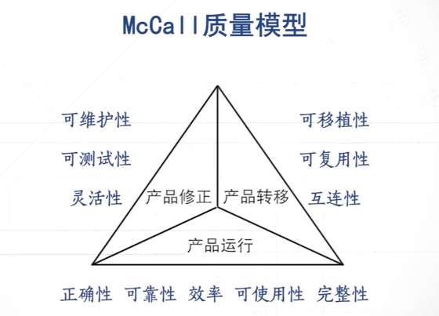
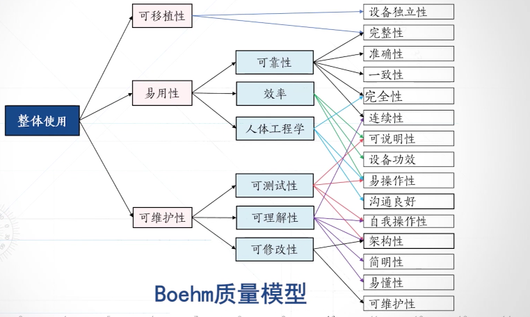
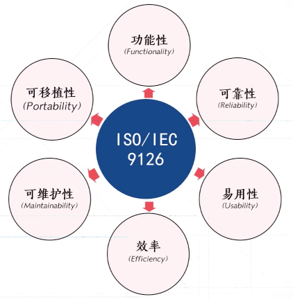

## 测试、运行与维护阶段的度量

软件产品的度量方法：

- 软件质量是产品的外部属性，而不是内部属性。
- 软件质量的定义：
  - 软件与明确的和隐含的定义的需求相一致的成都。
  - 软件质量是软件复合明确的功能与性能需求、文档中明确描述的开发标准以及所有专业开发的软件都应具有的隐含特征的程度。
- 软件质量模型：
  - McCall质量模型
  
  软件质量因素->质量准则->质量度量
  - Boehm质量模型

  - ISO 9126质量模型（较为通用）：

### 软件关键属性度量方法：

- 软件错误：是指在软件生存期内的不希望或不可接受的人为错误。软件错误的结果将导致软件缺陷的产生。
- 软件缺陷：是指存在与软件（文档、数据、程序）中那些不希望或不可接受的偏差

- 软件故障：软件运行过程中出现的一种不希望或不可接受的内部状态。软件故障是一种动态行为。

- 软件失效：软件运行是产生的一种不希望或不可接受的外部行为结果

软件的可靠性及其度量方法：

- 指软件产品在规定的条件下和规定的时间区间完成规定功能的能力
  - 规定条件：直接与软件运行相关的计算机系统的状态和软件的输如条件，统称为软件运行时的外部输入条件。
  - 规定功能：是指为提供给定的服务，软件产品所必须具备的功能。

度量方法：
1. 故障率度量法

2. 平均故障间隔时间（MTBF）度量方法：

3. 平均维修时间（MTTR）度量方法：反映了软件的可修复能力，平均修复时间越短，表示软件的可修复性越高。

- 软件的可用性：可用时间/可用时间+不可用时间

- 软件的易用性：
  - 使用菜单和图形界面
  - 具有一致的用户界面
  - 提供丰富全面的错误消息
  - 具有结构良好的用户手册
  - 实时提供软件帮助功能
- 软件维护：
  - 纠正性维护
  - 适应性维护
  - 预防性
  - 完善性
- 软件的可维护性一般通过平均修复时间MTTRR来度量。时间越短，可维护性越好
- 软件的可移植性：

## 开源软件的度量：

- 开源软件及其特点：
  - 允许用户基于OSI列出的开源协议，在协议许可的范围内只有使用、修改软件源代码，并且可以将软件源代码与其他代码进行结合使用的一种软件形式。
  - 充分共享 自由协同 无偿贡献 用户创新
- 开源社区的特点
  - 开放源代码社区，是一种由拥有共同兴趣爱好的人员组成，根据相应的开源软件许可证协议公布源代码的平台
  - 知名开源社区：github Sourceforge OpenSource Freecode
  - 中国的开源社区有： Linux中国、开源中国社区、LUPA
- 如何来度量开源软件的质量？
  - 质量的评价
  - 流行度的评价
  - 
- OpenBRR模型：对整个开源社区以标准和开放的方式对开源软件进行评级。
  - 质量属性：可用性、质量、支持度、社区性、易用性、安全性、性能、可拓展性、架构、文档。
  - 可用性：
    - 终端用于UI体验
    - 安装开源软件的必要设置时间
    - 安装/配置时间等数据
  - 质量：
    - 
  - 支持度：
    - 过去半年邮件列表平均容量
    - 专业性支持的质量
  - 社区性度量
    - 过去半年邮件列表平均容量
    - 过去半年独特的代码贡献数量
- 其他的开源项目度量模型：
  