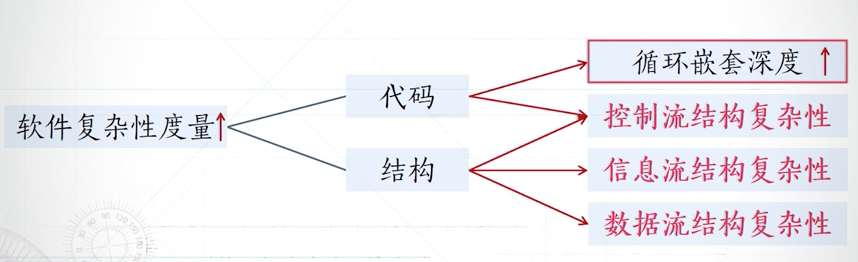
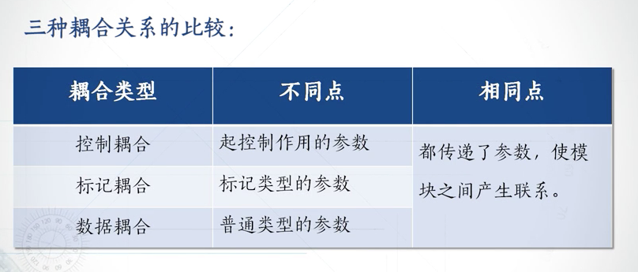

# 软件结构度量

软件的内部结构：
- 控制流结构 (详细设计阶段)
  - 解决的是各种指令在程序中的执行顺序问题，反映了程序的迭代与循环性质
- 数据结构 (详细设计阶段)
  - 数据自身的组织问题，若结构较好，会更加容易实现一些算法
- 数据流结构 (概要设计阶段)
  - 描述了数据与程序进行交互的行为

软件度量可以从 代码  结构两方面来看复杂性：

## 结构度量之模块内聚性度量

模块类聚：是指完成同一任务时对模块内各个组成部分的需要程度。
1. 功能内聚
   1. 模型完成一个定义良好的功能
2. 顺序内聚
   1. 模块的各个成分和同一个功能密切相关。而且一个成分的输出作为另一个成分的输入
3. 通信内聚 
   1. 是指模块内所有功能都操作同一数据集或生成同一数据集
4. 过程内聚
   1. 是指模块完成的功能不止一个，但多个功能需要特定的步骤来执行
5. 时间内聚
   1. 是指模块完成的功能必须在同一时间内执行，且只是因为时间因素关联在一起。
6. 逻辑内聚
   1. 是指模块内几个功能是逻辑上相关的。
7. 偶然内聚
   1. 模块的各成分之间毫无关系

内聚率 = 模块数（功能内聚）/ 总模块数

## 结构度量之模块间耦合性度量

模块耦合：指两个模块之间的相互依赖程度

一般来说，模块之间的联系越多，模块的**调用关系**越复杂，模块对的耦合性越高，系统的全局耦合性也就越高。

耦合的分类：

1. 无耦合  R0级别
   1. 表示两个模块之间无联系，两个模块完全独立
2. 数据耦合 R1 （至少，也必须存在这类耦合）
   1. 表示两个模块通过参数发生联系，其中每个参数要么是数据元素，要么是不含控制元素的**同类数据项**的集合
3. 标记耦合  R2 前三个松耦合
   1. 两个模块通过参数表传递相同的数据类型。两个模块共享了相同的**记录类型**。自定义结构的子结构
4. 控制耦合  R3 尽量避免
   1. 模块x为了控制y模块而向其传递了一个表示控制信息的参数
   
5. 公共耦合  R4 （尽量少设置全局变量）
   1. 两个模块都访问了一个公共数据环境（全局数据结构、共享都通信区、内存的公共覆盖区）
6. 内容耦合  5
   1. 一个模块引用到另一个模块到内部。
   

- 结构化软件设计时的两个规则：
  - 结构化的设计要保证单入口和单出口。
  - 尽量避免使用goto语句，从一个程序跳转到另一个程序内部

无耦合最好，但是不可能做到都无耦合的。

模块对的耦合计算方法：
一种耦合关系，一条模块间的连线。

系统的全局耦合度的计算耦合度：

众多模块对耦合度 的**中位数**C（s）

### 软件结构度量之信息流结构度量：

信息流产生的两种情况：
- 一个模块调用另一个模块，并且向该模块传递信息
- 被调用模块向调用模块返回一个返回值

描述模块信息流的属性：

- 扇入：是指直接调用该模块的上级模块的个数 扇入大表示该模块的**可重用性高**
- 扇出：该模块直接调用的下级模块的个数 扇出大表示该模块的复杂度高 （一般来说扇出不超过7）   扇入，扇出都不易过大、过小。
- 扇出太大，分中间模块，扇出太小，分解模块或者合并到上级模块。

信息流复杂性的度量方法：

两种方法

一：

二：

存在的一个问题：
- 当某个模块的扇入或扇出为0的时候，计算得到的这个模块的信息流复杂性也会是0

信息流复杂性的度量方法的优缺点：
优点：
1. 能够在测试阶段测量出系统各模块之间信息流结构的复杂性
2. 可以用于预测系统潜在的设计变更
   1. 一般来说扇入扇出大的模块，变更的可能性越高，越容易出错，越难以测试与维护
3. 信息流结构度量方法适用于度量 **数据驱动的软件项目**
缺点： 所有信息流权重一致，没有考虑信息流**本身的复杂程度不同**