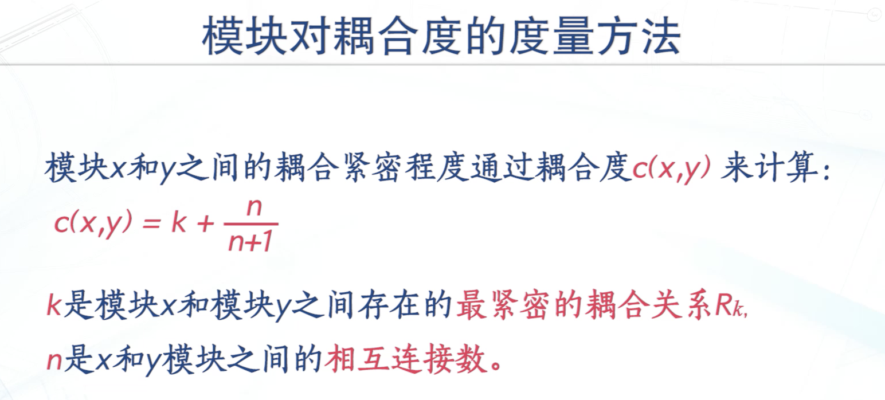

# 软件结构度量

软件的内部结构：
- 控制流结构
  - 解决的是各种指令在程序中的执行顺序问题，反映了程序的迭代与循环性质
- 数据结构
  - 数据自身的组织问题，若结构较好，会更加容易实现一些算法
- 数据流结构
  - 描述了数据与程序进行交互的行为

软件度量可以从 代码  结构两方面来看复杂性：

## 结构度量之模块内聚性度量

1. 功能内聚
2. 顺序内聚
3. 通信内聚
4. 过程内聚
5. 时间内聚
6. 逻辑内聚
7. 偶然内聚

内聚率 = 模块数（功能内聚）/ 总模块数

## 结构度量之模块偶尔性度量

模块耦合：指两个模块之间的相互依赖程度

一般来说，模块之间的联系越多，模块的调用关系越复杂，模块对的耦合性越高，系统的全局耦合性也就越高。

耦合的分类：

1. 无耦合  0级别
2. 数据耦合 1
3. 标记耦合  2 前三个松耦合
4. 控制耦合  3
5. 公共耦合  4
6. 内容耦合  5

无耦合最好，

模块对的耦合计算方法：

系统的全局耦合度的计算耦合度：

众多模块对耦合度 的中位数 C（s）

### 软件结构度量之信息流结构度量：

- 扇入：是指直接调用该模块的上级模块的个数 扇入大表示该模块的**可重用性高**
- 扇出：该模块直接调用的下级模块的个数 扇出大表示该模块的复杂度高 （一般来说扇出不超过7）

信息流复杂性的度量方法：

两种方法

一：

二：

信息流复杂性的度量方法的优缺点：
优点：
1. 能够在测试阶段测量出系统各模块之间信息流结构的复杂性
2. 可以用于预测系统潜在的设计变更
3. 信息流结构度量方法适用于度量 **数据驱动的软件项目**
缺点： 所有信息流权重一致，没有考虑信息流**本身的复杂程度不同**