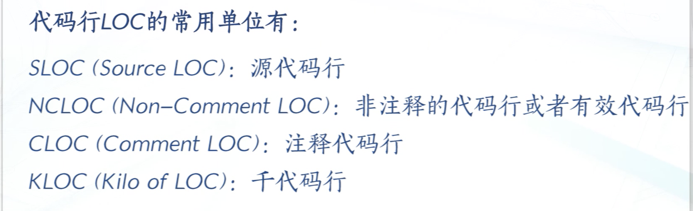
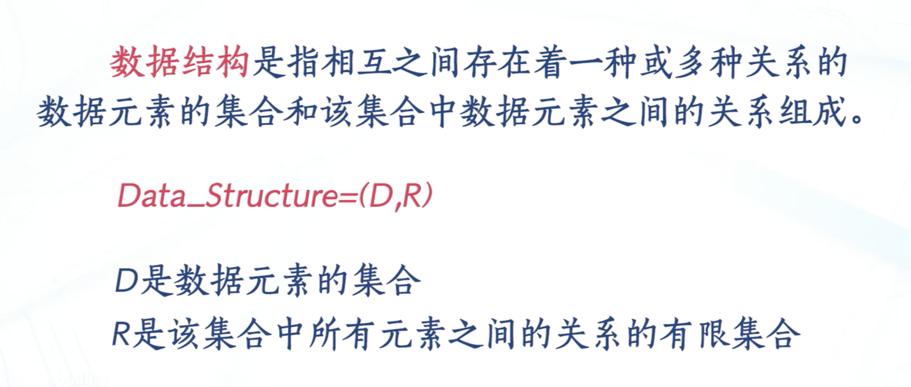
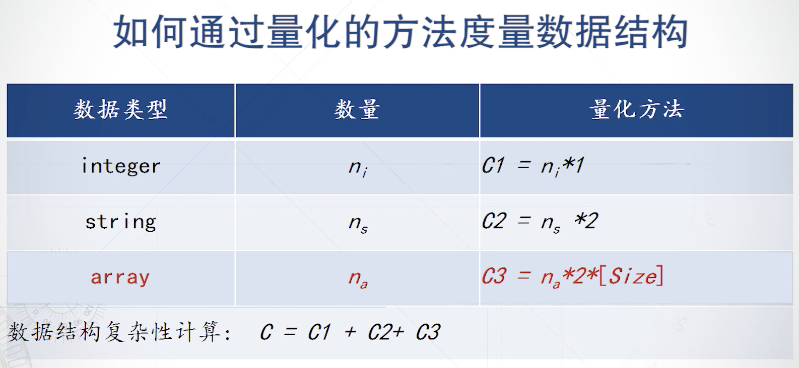

## 软件代码度量：

代码行：
一般指多有的可执行的源代码行数，包括可交付的工作控制语言语句、数据定义、数据类型声明、输入/输出格式声明等。

PLOC：物理代码行，表示除了注视外的源程序行数：

LLOC：逻辑代码行， 表示可执行的源程序行数。

- LOC度量方法的缺点：
  - 定于模糊
  - 与程序语言相关
  - 与程序员的能力相关
  - 不适用于软件开发的早期阶段对软件的规模进行预测
- ...优点：
  - 可以自动测量
  - 直观测量方法：代码行数直接反映软件的规模大小与程序的工作量及成本直接相关

## 软件结构度量值数据结构度量方法：

### 量化方法度量数据结构：

- 代码行数
- 程序控制流结构
- 数据结构

采用不同的代码度量方法，可能得到的结果也不同。应该综合考虑上述三种复杂性
