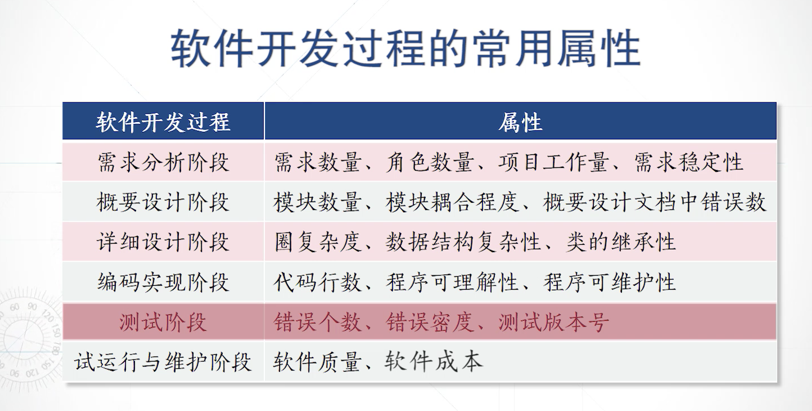
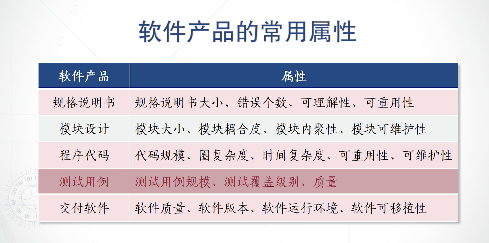
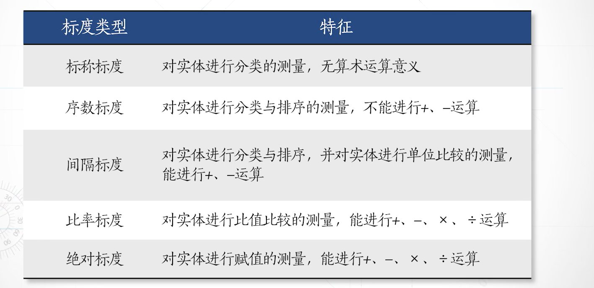
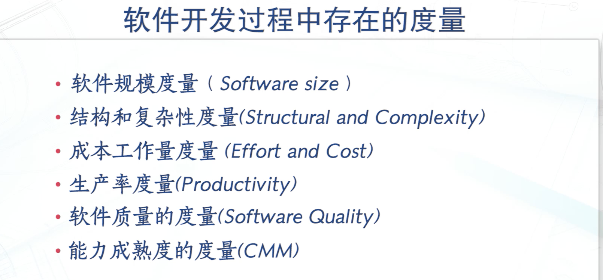
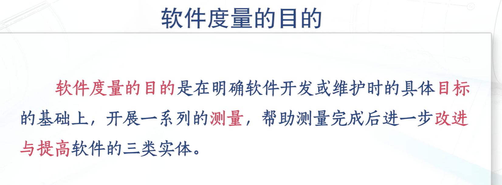

# 软件测量 01-02

## 什么是软件测量

### 软件测量的定义：
软件测量是按照某种规则，用数据或者符号对软件项目、软件开发过程、软件产品这三类软件实体的相关属性进行赋值的过程。即对软件三类实体作出量化的描述。

### 软件测量的目的：
就是为了了解、预测、控制与提高软件的三类实体，即软件项目、软件开发过程以及软件产品。

## 如何对软件测量

软件实体的常用属性：
- 软件项目常用属性

- 软件开发过程中的常用属性

- 软件产品的常用属性：

- 直接测量

- 间接测量（一般来说，间接测量更加有效）

## 测量的标度：

### 测量标度的类型：

- 标称标度： 是一种分类
- 序数标度： 加入了类或类别的顺序关系
- 间隔标度：含有对各个类进行分隔的间隔规模信息（一次函数）
- 比率标度：含有对各个类进行分隔对比率规模信息 （比例函数）
- 绝对标度：对实计数的结果可以进行任何运算 （代码错误数）

## 软件度量：

什么是软件度量：

度量是指用以计量实体的一些物理属性的标准

软件度量 是衡量软件项目、软件开发过程、软件产品的属性值达到一定程度的**测量标准**

测量是给实体属性赋值，结果是属性值
度量作为测量的标准，实际是一个函数

测量和度量的差别：

度量是一个过程，是一个函数，是对应法则

测量是得到了因变量

- 软件开发中存在的度量：

- 软件度量的目的：

- 软件度量的分类：
  - 按照测试对象分：
实体度量：（软件结构的度量，代码规模

非实体度量：（可理解性，可靠性

- 按照度量的复杂程度分：
    - 简单度量
    - 复杂度量

